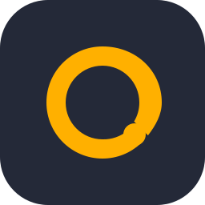
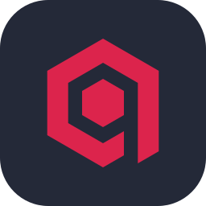
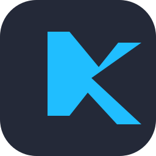

# M. Said Zengin

Software engineer interested in algorithms, cybersecurity, data science, and NLP.

[msaidzengin.com](https://msaidzengin.com) · [LinkedIn](https://www.linkedin.com/in/msaidzengin)

**Languages**

**Web**

**Search and ML**

**Mobile and more**

**Tools**

